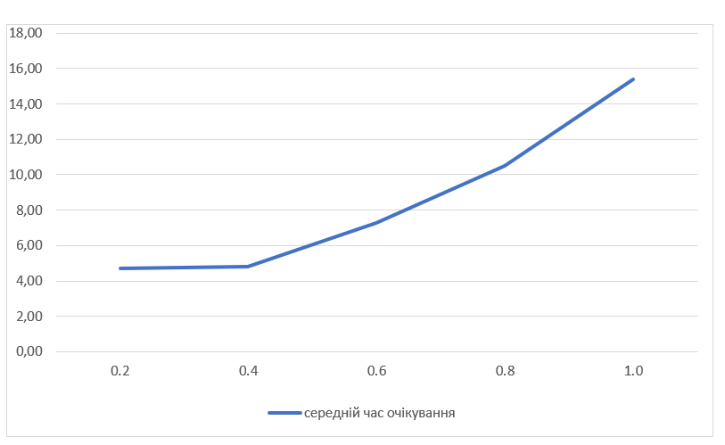

## Комп'ютерні системи імітаційного моделювання
## СПм-23-3, **Первєєв Володимир Дмитрович**
### Лабораторна робота №**1**. Опис імітаційних моделей та проведення обчислювальних експериментів

 

### Варіант 1, модель у середовищі NetLogo:
[Traffic Grid](http://www.netlogoweb.org/launch#http://www.netlogoweb.org/assets/modelslib/Sample%20Models/Social%20Science/Traffic%20Grid.nlogo)

 

### Вербальний опис моделі:
Ця модель є симуляцією руху транспорту та управління світлофорами в сітці доріг. Вона створює віртуальні машини, які пересуваються сіткою доріг і підпорядковуються правилам руху, що встановлюються світлофорами на перехрестях. Кожен aвтомобіль може рухатися вгору або вправо.

### Керуючі параметри:
- **grid-size-x, grid-size-y**
- **num-cars**
- **power?**
- **ticks-per-cycle**
- **speed-limit**
- **current-auto?**
- **current-phase**

### Внутрішні параметри:
- **grid-x-inc, grid-y-inc**
- **acceleration**
- **num-cars-stopped**
- **current-light**
- **intersections**
- **roads**
- **speed**
- **up-car?**
- **wait-time**

### Показники роботи системи:
- **STOPPED CARS**
- **AVERAGE SPEED OF CARS**
- **AVERAGE WAIT TIME OF CARS**

### Недоліки моделі:
- Наразі максимальне обмеження швидкості (яке встановлено на повзунку SPEED-LIMIT) для автомобілів складає 1,0, що є доволі незручним обмеженням.
- Коли автомобіль досягає краю світу, він знову з’являється з іншого боку. Це виглядає не зовсім реалістично. Було б краще, якби він просто зникав на межі світу, а нові автомобілі з'являлися на протилежному боці у випадкових місцях і через випадкові інтервали часу.
- У моделі світлофорів відсутній жовтий колір.

 

## Обчислювальні експерименти
### 1. Вплив обмеження швидкості на середній час очікування автомобілів

У цьому дослідженні вивчається, як обмеження швидкості впливає на середній час очікування автомобілів протягом 1000 тактів. Експерименти проводяться при різних значеннях обмеження швидкості від 0.2 до 1.0 з кроком 0.2, що охоплює 5 різних значень обмеження. Для кожного значення обмеження швидкості проводиться одна симуляція.

Інші параметри, які впливають на симуляцію, зберігаються на рівні значень за замовчуванням.
- **grid-size-x**: 5
- **grid-size-y**: 5
- **num-cars**: 200
- **power?**: on
- **ticks-per-cycle**: 20
- **current-auto?**: on
- **current-phase**: 0

<table>
<thead>
<tr><th>Обмеження швидкості</th><th>Середній час очікування</th></tr>
</thead>
<tbody>
<tr><td>0.2</td><td>4.73</td></tr>
<tr><td>0.4</td><td>4.80</td></tr>
<tr><td>0.6</td><td>7.30</td></tr>
<tr><td>0.8</td><td>10.50</td></tr>
<tr><td>1.0</td><td>15.40</td></tr>
</tbody>
</table>

Графік наочно демонструє, що чим менше обмеження швидкості (тобто чим швидше рухаються автомобілі), тим більше часу вони проводять у черзі, чекаючи на світлофор або в інших ситуаціях, що здається контрінтуїтивним. Однак, уважно розглянувши модель, можна зрозуміти, що, незважаючи на зміну обмеження швидкості, машини доїжджають від початку до кінця за приблизно однакові проміжки часу. Це означає, що при низькому обмеженні швидкості машини хоч і рухаються повільніше, але постійно рухаються, а при високому обмеженні швидкості вони більше часу витрачають на стояння під червоним світлом світлофора.

### 2.  **Вплив кількості автомобілів на дорозі на середній час очікування автомобілів**

У цьому дослідженні вивчається, як зміна кількості автомобілів на дорозі впливає на середній час очікування автомобілів протягом 1000 тактів. Експерименти проводяться при кількості автомобілів від 60 до 300, з кроком 60, що дає 5 різних рівнів завантаження дороги.

Для кожної симуляції проводиться один експеримент.

Інші параметри моделі залишаються на рівні значень за замовчуванням.
- **grid-size-x**: 5
- **grid-size-y**: 5
- **speed-limit**: 1.0
- **power?**: on
- **ticks-per-cycle**: 20
- **current-auto?**: on
- **current-phase**: 0

<table>
<thead>
<tr><th>Кількість автомобілів</th><th>Середній час очікування</th></tr>
</thead>
<tbody>
<tr><td>60</td><td>4.0</td></tr>
<tr><td>120</td><td>5.03</td></tr>
<tr><td>180</td><td>11.6</td></tr>
<tr><td>240</td><td>18.5</td></tr>
<tr><td>300</td><td>435</td></tr>
</tbody>
</table>

*Графік не точно передає наявні дані. При значенні 450 він стає нечитабельним. Тому було вирішено, знехтувавши точністю графіка, зробити його більш наочним.*

Графік наочно показує, що зростання кількості автомобілів на дорозі призводить до збільшення середнього часу очікування. Це стає очевидним при порівнянні значень середнього часу очікування для різних рівнів кількості автомобілів. Зі збільшенням числа автомобілів від 60 до 240 середній час очікування зростає з 4,0 до 18 одиниць. При цьому при кількості в 300 автомобілів майже завжди виникає пробка, що охоплює все місто, що значно підвищує час очікування через затори.

### 3. **Вплив швидкості перемикання світлофора на середній час очікування автомобілів**

У цьому дослідженні аналізується, як швидкість перемикання світлофора впливає на середній час очікування автомобілів протягом 1000 тактів. Експерименти проводяться при різних значеннях часу перемикання світлофора, від 10 до 100 тікув, з кроком 10. Всього проводиться 10 симуляцій.

Інші параметри, що контролюють модель, залишаються на рівні значень за замовчуванням.
- **grid-size-x**: 5
- **grid-size-y**: 5
- **num-cars**: 150
- **power?**: on
- **speed-limit**: 1.0
- **current-auto?**: on
- **current-phase**: 0

<table>
<thead>
<tr><th>Тіки для перемикання світлофора</th><th>Середній час очікування</th></tr>
</thead>
<tbody>
<tr><td>10</td><td>225</td></tr>
<tr><td>20</td><td>14</td></tr>
<tr><td>30</td><td>38</td></tr>
<tr><td>40</td><td>64</td></tr>
<tr><td>50</td><td>71</td></tr>
<tr><td>60</td><td>21</td></tr>
<tr><td>70</td><td>20</td></tr>
<tr><td>80</td><td>63</td></tr>
<tr><td>90</td><td>16</td></tr>
<tr><td>100</td><td>46</td></tr>
</tbody>
</table>

Графік наочно демонструє, що існує оптимальне значення кількості тіків для перемикання світлофора, при якому середній час очікування автомобілів мінімізується. У цьому випадку оптимальним значенням є близько 60 тіків. Крім того, існують значення, при яких всі автомобілі потрапляють у затори, і це відбувається при дуже швидкому перемиканні світлофора, наприклад, при 10 тіках.