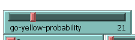

## Комп'ютерні системи імітаційного моделювання
## СПм-23-3, **Первєєв Володимир Дмитровичч**
### Лабораторна робота №**2**. Редагування імітаційних моделей у середовищі NetLogo

 

### Варіант 1, модель у середовищі NetLogo:
[Traffic Grid](http://www.netlogoweb.org/launch#http://www.netlogoweb.org/assets/modelslib/Sample%20Models/Social%20Science/Traffic%20Grid.nlogo)

 

### Внесені зміни у вихідну логіку моделі, за варіантом:

**Додати жовтий сигнал світлофорів.** 

Змінено глобальну змінну *green-light-up?*. Тепер у неї 3 значення: 1 - зелений, 2 - жовтий, 3 - червоний. Її нова назва:
<pre> 
light-state
</pre>

Змінено процедру зміни стану світлофорів.
<pre>
  to set-signals
  ask intersections with [auto? and phase = floor ((my-phase * ticks-per-cycle) / 100)]
  [
    ifelse light-state = 3
    [set light-state 1]
    [set light-state light-state + 1]
    set-signal-colors
  ]
end
</pre>

Змінено процедуру встановлення кольору для світлофора. Додано жовтий колір.
<pre>
  to set-signal-colors  ;; intersection (patch) procedure
  ifelse power?
  [ 
    if light-state = 1
     [
      ask patch-at -1 0 [ set pcolor yellow ]
      ask patch-at 0 1 [ set pcolor red ]
     ]
    
    if light-state = 2
    [
      ask patch-at -1 0 [ set pcolor green ]
      ask patch-at 0 1 [ set pcolor yellow ]
    ]
    if light-state = 3
    [
      ask patch-at -1 0 [ set pcolor red ]
      ask patch-at 0 1 [ set pcolor green ]
    ]
  ]
  
  [
    ask patch-at -1 0 [ set pcolor white ]
    ask patch-at 0 1 [ set pcolor white ]
  ]
end
</pre>

**Додати вірогідність початку руху водіями не тільки на зелений, але і на жовтий сигнал світлофора.**

Додано слайдер для встановлення вірогідності початку руху водіями не тільки на зелений, але і на жовтий сигнал світлофора:

Змінено процедуру *set-car-speed*. Тепер автомобілі зупиняються на жовтий колір світлофора і з деякою ймовірністю їдуть на жовтий колір світлофора:
<pre>
  to set-car-speed  ;; turtle procedure
  ifelse pcolor = red 
  [ set speed 0 ]
  [
    ifelse pcolor = yellow and go-yellow-probability < random 100 [set speed 0] [
    ifelse up-car?
    [ set-speed 0 -1 ]
    [ set-speed 1 0 ]
    ]
  ]
end
</pre>

### Внесені зміни у вихідну логіку моделі, на власний розсуд:

**Додана можливість змінювати прискорення автомобілів на дорозі**

Доданий відповідний слайдер:

Код процедур, які відповідають за прискорення:
<pre>
  to slow-down  ;; turtle procedure
  ifelse speed <= 0  ;;if speed < 0
  [ set speed 0 ]
  [ set speed speed - acceleration ]
end

;; increase the speed of the turtle
to speed-up  ;; turtle procedure
  ifelse speed > speed-limit
  [ set speed speed-limit ]
  [ set speed speed + acceleration ]
end
</pre>

Фінальний код моделі та її інтерфейс доступні за 
[посиланням](Traffic-Grid-2.nlogo)

 

## Обчислювальні експерименти 
### 1. Вплив вірогідності початку руху водіями не тільки на зелений, але і на жовтий сигнал світлофора на середній час очікування автомобілів.
Досліджується вплив вірогідності початку руху водіями не тільки на зелений, але і на жовтий сигнал світлофора на середній час очікування автомобілів. протягом певної кількості тактів (1000).
Експерименти проводяться при 10-100 значеннях вірогідності початку руху, з кроком 10, усього 10 симуляцій.  
Інші керуючі параметри мають значення за замовчуванням:
- **grid-size-x**: 5
- **grid-size-y**: 5
- **num-cars**: 200
- **ticks-per-cycle**: 20
- **power?**: on
- **speed-limit**: 1.0
- **current-auto?**: on
- **current-phase**: 0
- **acceleration**: 0.099

<table>
<thead>
<tr><th>Вірогідність початку руху на жовтий</th><th>Середній час очікування</th></tr>
</thead>
<tbody>
<tr><td>10</td><td>17</td></tr>
<tr><td>20</td><td>24</td></tr>
<tr><td>30</td><td>27</td></tr>
<tr><td>40</td><td>37</td></tr>
<tr><td>50</td><td>34</td></tr>
<tr><td>60</td><td>42</td></tr>
<tr><td>70</td><td>48</td></tr>
<tr><td>80</td><td>63</td></tr>
<tr><td>90</td><td>68</td></tr>
<tr><td>100</td><td>83</td></tr>
</tbody>
</table>

Графік наочно показує, що збільшення вірогідності початку руху при жовтому сигналі призводить до збільшення середнього часу очікування автомобілів. Це виявляється зрозумілим, оскільки більша ймовірність того, що водії розпочнуть рух на жовтий, веде до більшої кількості автомобілів, які мають чекати на перехресті, адже водії, які їдуть на жовтий заважають іншим водіям.

