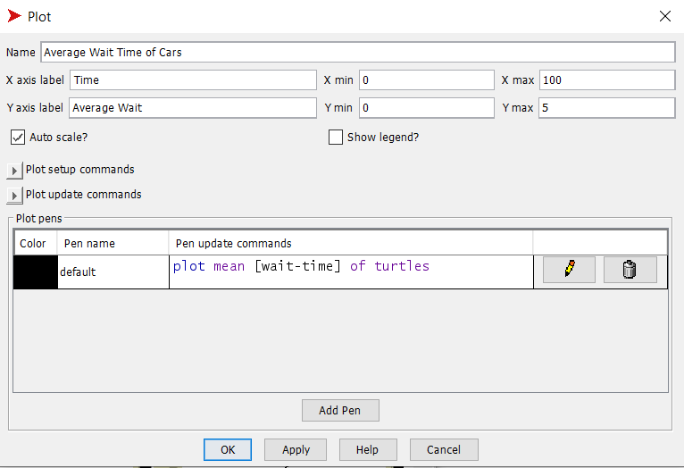
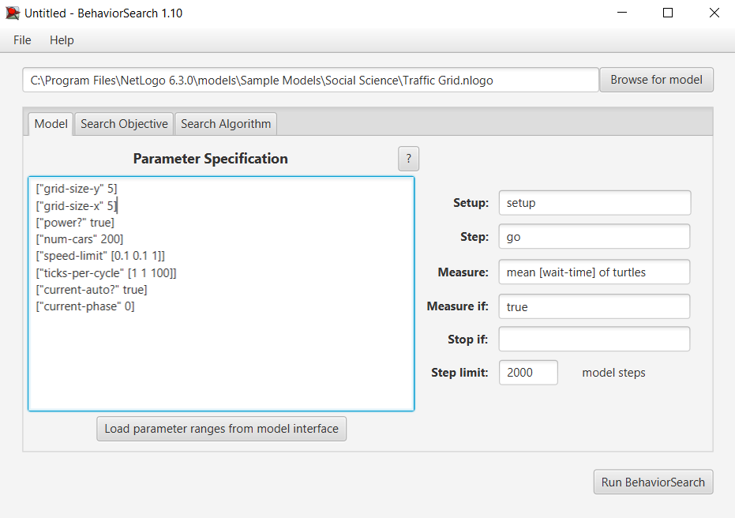
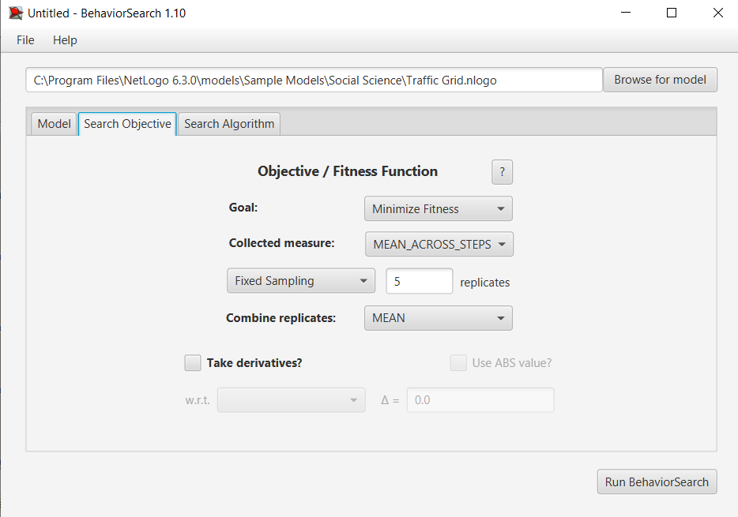
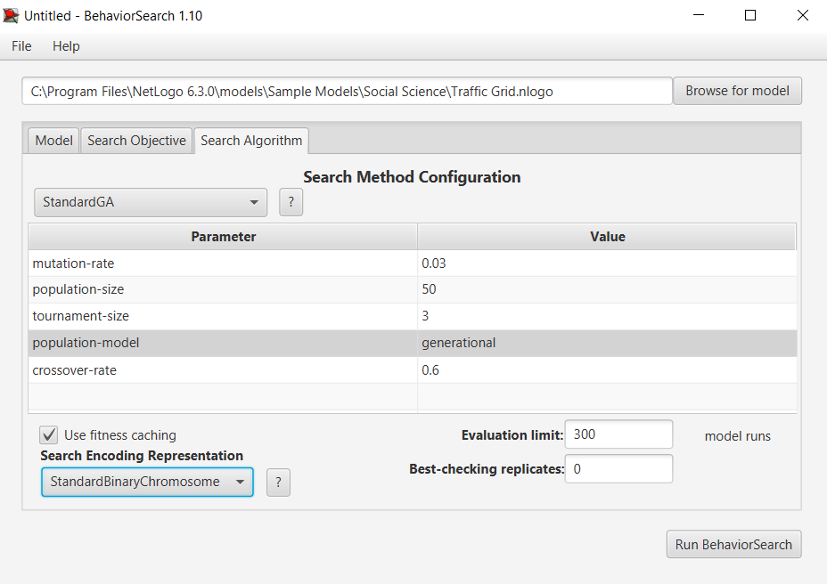
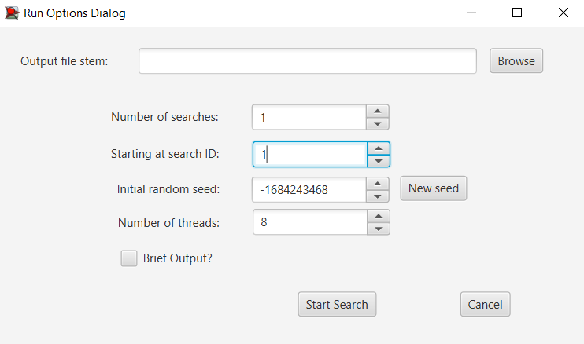
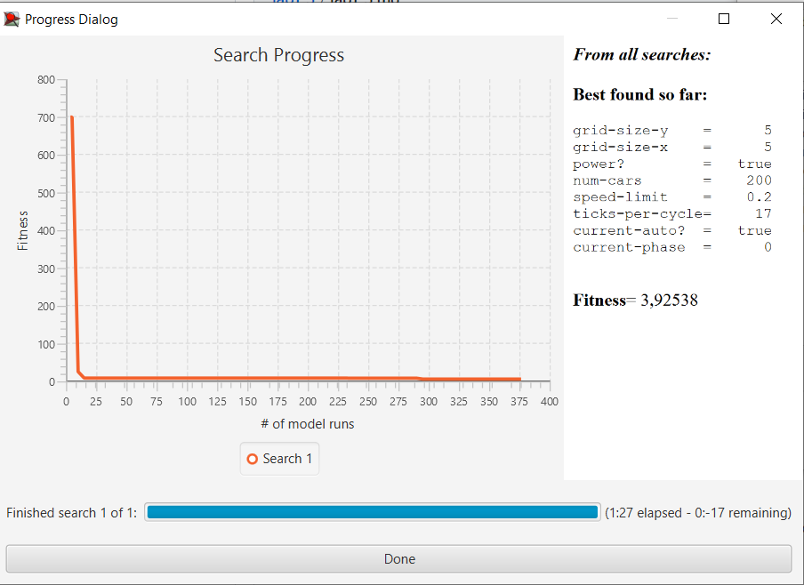
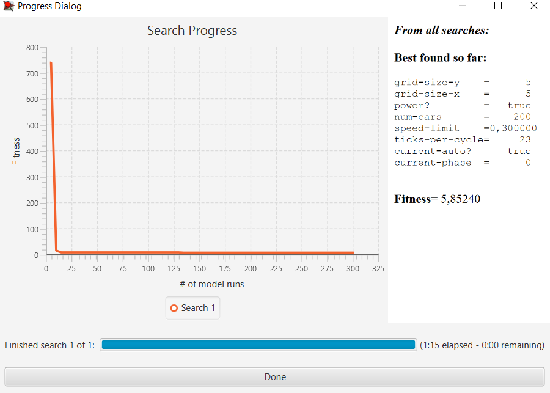

## Комп'ютерні системи імітаційного моделювання
## СПм-23-3, **Первєєв Володимир Дмитрович**
### Лабораторна робота №**3**. Використання засобів обчислювального интелекту для оптимізації імітаційних моделей

 

### Варіант 1, модель у середовищі NetLogo:
Варіант 1, модель у середовищі NetLogo:
[Traffic Grid](http://www.netlogoweb.org/launch#http://www.netlogoweb.org/assets/modelslib/Sample%20Models/Social%20Science/Traffic%20Grid.nlogo)

 

### Вербальний опис моделі:

**Встав сюди посилання на першу лабораторну**

### Налаштування середовища BehaviorSearch:

**Обрана модель**:
<pre>
C:\Program Files\NetLogo 6.3.0\models\Sample Models\Social Science\Traffic Grid.nlogo
</pre>
**Параметри моделі** (вкладка Model):  
<pre>
["grid-size-y" 5]
["grid-size-x" 5]
["power?" true]
["num-cars" 200]
["speed-limit" [0.1 0.1 1]]
["ticks-per-cycle" [1 1 100]]
["current-auto?" true]
["current-phase" 0]
</pre>
Використовувана **міра**:  :
Для фітнес-функції було обрано **середній час зупинки автомобілів**. Її значення береться з графіку в моделі:

та вказано у параметрі "**Measure**":
<pre>
mean [wait-time] of turtles
</pre>
Середній час зупинки автомобілів враховується **в середньому** за весь період симуляції тривалістю, 2 000 тактів, починаючи з 0 такту симуляції.  
Параметр зупинки за умовою ("**Stop if**") не використовувався.  
Загальний вигляд вкладки налаштувань параметрів моделі:

**Налаштування цільової функції** (вкладка Search Objective):  
Метою підбору параметрів імітаційної моделі є **мінімізація** значення середнього часу зупинки автомобілів – це вказано через параметр "**Goal**" зі значенням **Minimize Fitness**. Тобто необхідно визначити такі параметри налаштувань моделі, у яких значення середнього часу зупинки автомобілів за час симуляції мінімальна. Для цього у параметрі "**Collected measure**", що визначає спосіб обліку значень обраного показника, вказано **MEAN_ACROSS_STEPS**.  
Щоб уникнути викривлення результатів через випадкові значення, що використовуються в логіці самої імітаційної моделі, **кожна симуляція повторюється по 5 разів**, результуюче значення розраховується як **середнє арифметичне**. 
Загальний вигляд вкладки налаштувань цільової функції:

**Налаштування алгоритму пошуку** (вкладка Search Algorithm):  
Загальний вид вкладки налаштувань алгоритму пошуку: 

 

### Результати використання BehaviorSearch:
Діалогове вікно запуску пошуку 

Результат пошуку параметрів імітаційної моделі, використовуючи **генетичний алгоритм**:

Результат пошуку параметрів імітаційної моделі, використовуючи **випадковий пошук**:

 
